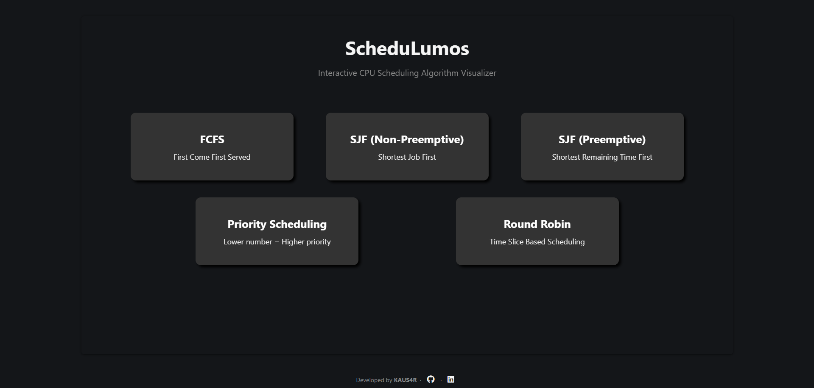

# ScheduLumos

ScheduLumos is a Flask-based CPU scheduling simulator that helps students and developers visualize and compare scheduling behavior for common algorithms.



## What This Project Does

You can input process data from the browser and run scheduling calculations on the server. The app returns:

- per-process metrics (waiting time, turnaround time, completion time)
- average waiting and turnaround times

## Implemented Algorithms

- First Come First Served (FCFS)
- Shortest Job First Non-Preemptive (SJF-NP)
- Shortest Job First Preemptive (SJF-P)
- Priority Scheduling
- Round Robin (RR)

## Tech Stack

- Backend: Python, Flask
- Frontend: HTML, CSS, Vanilla JavaScript
- Deployment: Vercel

## Input Rules and Validation

Current validation rules enforced by backend and frontend:

- Arrival time must be `>= 0`
- Burst time must be `> 0`
- Time quantum (Round Robin) must be `>= 1` (defaults to `2` if omitted)
- Number of arrival and burst values must match
- For priority scheduling, arrival, burst, and priority lengths must match
- Inputs are parsed as integers from space-separated values

If validation fails, the server returns an `error` string in the JSON response.

## Project Structure

```text
ScheduLumos-main/
|-- app.py
|-- requirements.txt
|-- vercel.json
|-- python/
|   |-- fcfs.py
|   |-- priority_scheduling.py
|   |-- round_robin.py
|   |-- run_algorithms.py
|   |-- sjf_non_preemptive.py
|   |-- sjf_preemptive.py
|   `-- utils.py
|-- static/
|   |-- css/
|   |   |-- algorithm_style.css
|   |   `-- styles.css
|   |-- images/
|   `-- js/
|       |-- algorithm_common.js
|       |-- fcfs.js
|       |-- priority_schedule.js
|       |-- round_robin.js
|       |-- sjf_non_preemptive.js
|       `-- sjf_preemptive.js
`-- templates/
      |-- fcfs.html
      |-- index.html
      |-- priority_scheduling.html
      |-- round_robin.html
      |-- sjf_non_preemptive.html
      `-- sjf_preemptive.html
```

## Run Locally

### Prerequisites

- Python 3.9+
- pip

### Steps

1. Clone repository and enter project directory.

```bash
git clone https://github.com/kausaraahmed/scheduLumos.git
cd scheduLumos
```

2. Create and activate virtual environment.

Windows (PowerShell):

```powershell
python -m venv .venv
.\.venv\Scripts\Activate.ps1
```

Linux/macOS:

```bash
python3 -m venv .venv
source .venv/bin/activate
```

3. Install dependencies.

```bash
pip install -r requirements.txt
```

4. Start server.

```bash
python app.py
```

5. Open in browser:

```text
http://127.0.0.1:5000/
```

## Live Demo

<https://schedulumos.vercel.app>

## Contributing

Contributions are welcome.

1. Fork the repository.
2. Create a feature branch.
3. Commit your changes.
4. Open a pull request.

## License

Licensed under the MIT License. See `LICENSE` for details.
