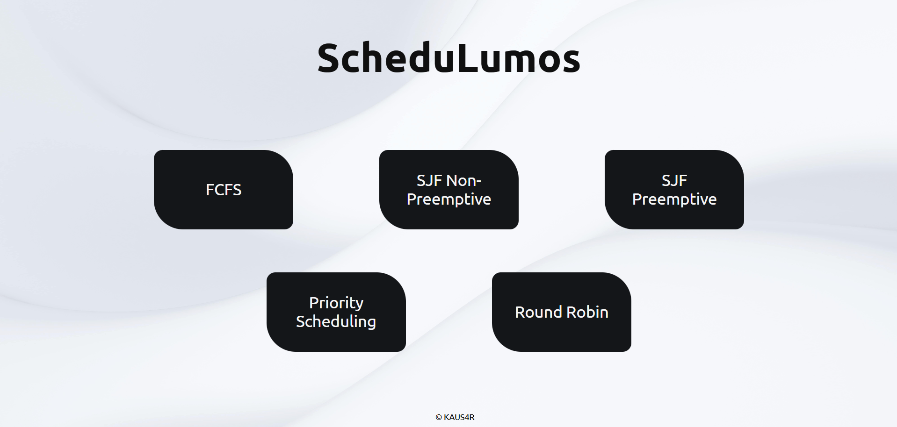

# ScheduLumos



## Table of Contents

- [Introduction](#introduction)

- [Features](#features)

- [Technologies Used](#technologies-used)

- [Setup](#setup)

- [Usage](#usage)

- [Deployed Site](#deployed-site)

- [License](#license)

- [Contributing](#contributing)

## Introduction

**ScheduLumos** is a web application designed to simulate and visualize various CPU scheduling algorithms. The
application allows users to input parameters such as arrival time, burst time, and priority to understand how different
algorithms schedule processes. This tool is particularly useful for students and educators in computer science to learn
and demonstrate the behavior of CPU scheduling algorithms.

## Features

- **Multiple Algorithms**: Supports various CPU scheduling algorithms including:

- First-Come, First-Served (FCFS)

- Shortest Job First (SJF) - Preemptive and Non-Preemptive

- Priority Scheduling

- Round Robin (RR)

- **Interactive Input**: Users can input process details like arrival time, burst time, and priority through an
  intuitive UI.

- **Exception Handling**: It is also packed with error handling capabilities. for example, provokes non-numeric input,
  uneven arrival and burst time, and such.

- **Results Visualization**: The site displays the execution order of processes along with average waiting time,
  turnaround time, and other relevant metrics.

- **Download Results**: Users can download the scheduling results as a `.txt` file for further analysis.

- **Responsive Design**: The interface is responsive and works well on both desktop and mobile devices.

## Technologies Used

- **Frontend**:

- HTML5

- CSS3 (with Google Fonts integration)

- JavaScript (for interactive features)

- **Backend**:

- Python

- Flask (web framework)

- **Deployment**:

- Render (for hosting the application)

- GitHub (for version control and continuous deployment)

## Structure:
```bash
Schedulumos
│
├── readme.md
├── LICENSE
├── app.py
├── requirements.txt
├── vercel.json
├── python/
│   ├── fcfs.py
│   ├── priority_scheduling.py
│   ├── round_robin.py
│   ├── run_algorithms.py
│   ├── sjf_non_preemptive.py
│   ├── sjf_preemptive.py
│   ├── tempCodeRunnerFile.py
│   ├── utils.py
│   └── __pycache__/
├── static/
│   ├── css/
│   │   ├── algorithm_page_style.css
│   │   ├── compare_style.css
│   │   └── styles.css
│   ├── images/
│   └── js/
│       ├── compare.js
│       ├── fcfs.js
│       ├── priority_schedule.js
│       ├── round_robin.js
│       ├── sjf_non_preemptive.js
│       └── sjf_preemptive.js
└── templates/
    ├── compare.html
    ├── fcfs.html
    ├── index.html
    ├── priority_scheduling.html
    ├── round_robin.html
    ├── sjf_non_preemptive.html
    └── sjf_preemptive.html
```

## Setup

### Prerequisites

- Python 3.x

- Git (for cloning the repository)

- A modern web browser

### Installation

1. **Clone the repository:**

```bash

git clone https://github.com/kausaraahmed/scheduLumos.git

cd scheduLumos

```

2. **Install dependencies:**

It's recommended to use a virtual environment:

```bash

python3 -m venv venv

source venv/bin/activate # On Windows use `venv\Scripts\activate`

pip  install  -r  requirements.txt

```

3. **Run the application locally:**

```bash

flask run

```

The application will be accessible at `http://127.0.0.1:5000/`.

### Deployment

The application is deployed on [Render](https://render.com/). To deploy your own version, push your changes to GitHub,
and Render will automatically build and deploy the application.

## Usage

1. **Access the application:**
   Open the deployed site or run it locally as described above.

2. **Navigate through scheduling options:**
   From the main menu, select the scheduling algorithm you want to simulate.

3. **Input process details:**
   Provide the necessary inputs like arrival time, burst time, and priority (if applicable).

4. **Run the algorithm:**
   Click on the "Run Algorithm" button to view the scheduling results.

5. **Download results:**
   After the results are displayed, click the download icon in the top right corner to save the results as a `.txt`
   file.

## Deployed Site

The application is live and accessible at: [https://schedulumos.vercel.app](https://schedulumos.vercel.app)

## License

This project is licensed under the MIT License. See the [LICENSE](LICENSE) file for details.

## Contributing

Contributions are welcome! Please fork the repository and create a pull request with your changes. Ensure that your code
follows the existing style and conventions.
